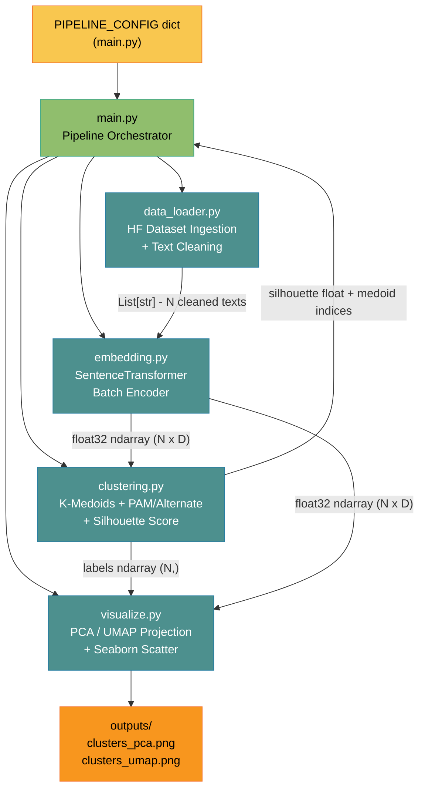
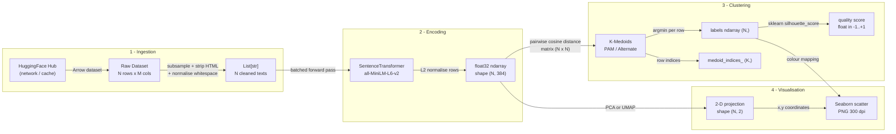
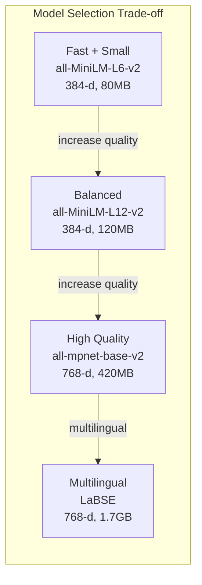
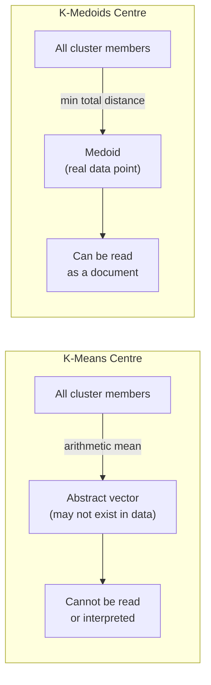
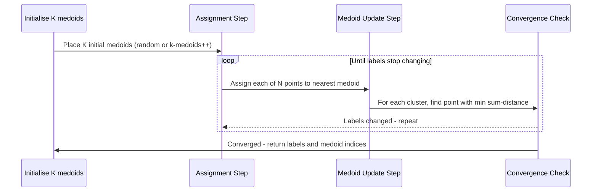
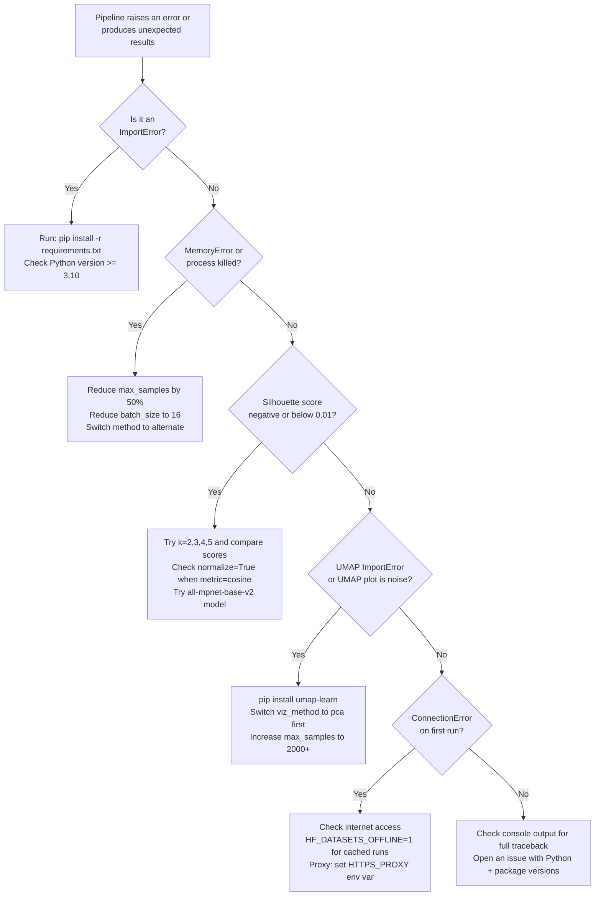

# K-Medoids Clustering with Hugging Face Data

<p align="center">
  
  
  
  
  
  
  
  
  
  
  
  
</p>

A complete, modular, production-ready Python ML pipeline for **unsupervised text clustering**. It loads any Hugging Face dataset, converts raw text into dense semantic vectors with SentenceTransformers, partitions documents into coherent thematic groups using K-Medoids, measures cluster quality with the Silhouette score, and renders publication-ready PCA and UMAP scatter plots. Every stage is driven by a single configuration dictionary, so you can swap datasets, models, distance metrics, and visualisation methods without modifying a single line of logic code.

This project demonstrates how modern pre-trained transformer embeddings produce dramatically richer representations than traditional TF-IDF or bag-of-words approaches, enabling high-quality unsupervised clustering on real-world text corpora without any labelled training data.

---

## Table of Contents

1. [Why This Project](#why-this-project)
2. [Architecture Overview](#architecture-overview)
3. [Tech Stack](#tech-stack)
4. [Project Structure](#project-structure)
5. [Pipeline Flow](#pipeline-flow)
6. [Quick Start](#quick-start)
7. [Configuration Reference](#configuration-reference)
8. [Embedding Model Guide](#embedding-model-guide)
9. [Algorithm Deep Dive](#algorithm-deep-dive)
10. [Evaluation Metrics](#evaluation-metrics)
11. [Visualisation Methods](#visualisation-methods)
12. [Module API Reference](#module-api-reference)
13. [Running Tests](#running-tests)
14. [Alternative Datasets](#alternative-datasets)
15. [Extending the Pipeline](#extending-the-pipeline)
16. [Performance Guide](#performance-guide)
17. [Troubleshooting](#troubleshooting)
18. [FAQ](#faq)

---

## Why This Project

Text clustering is one of the most practically useful techniques in natural language processing. It lets you discover hidden thematic structure inside a corpus without any labelled training data - a genuinely unsupervised approach that scales gracefully from hundreds to millions of documents. Common real-world applications include grouping customer support tickets by topic, discovering themes in research paper abstracts, segmenting user reviews by sentiment category, and organising news articles by subject area.

Traditional approaches to text clustering relied on sparse TF-IDF vectors, which treat each unique word as a dimension and have no concept of semantic similarity. The word "car" and the word "automobile" would be treated as completely unrelated dimensions, causing documents with synonymous vocabulary to land in different clusters. Modern sentence embedding models trained on massive text corpora learn to represent meaning, not just word frequency. Two sentences with completely different wording but identical meaning will have nearly identical embedding vectors, making clustering far more semantically meaningful.

K-Medoids was chosen over the more common K-Means because its cluster centres - called medoids - are always actual data points from the original corpus. This has a critical practical advantage: you can pull out any medoid document and read it, immediately understanding what the whole cluster represents. K-Means centroids are arithmetic averages of vectors, which may not correspond to any real document and cannot be directly interpreted.

> [!NOTE]
> This pipeline runs entirely locally after the first download. No API keys, cloud accounts, or internet connection are required after caching. All Hugging Face datasets and SentenceTransformer model weights are stored in `~/.cache/huggingface/` after the initial fetch.

> [!TIP]
> If you want to understand the theory before running any code, jump to the [Algorithm Deep Dive](#algorithm-deep-dive) section first. It explains K-Medoids, PAM vs Alternate, cosine distance, and the Silhouette score in plain language with supporting diagrams.

---

## Architecture Overview

The system is divided into four independent, testable modules orchestrated by a thin `main.py` entry point. Each module has exactly one responsibility and communicates with adjacent modules through well-defined NumPy array interfaces. This strict separation of concerns means you can replace any single component - for example, swapping the SentenceTransformer embedder for OpenAI's Embeddings API, or replacing K-Medoids with HDBSCAN - by editing only one file without touching the rest of the pipeline.

The data flow is strictly linear: raw strings come in, a float matrix flows to the clusterer, integer labels flow to the visualiser. No module has circular dependencies or shared mutable state.



> [!IMPORTANT]
> The modules are intentionally decoupled. `embedding.py` has no knowledge of clustering algorithms, and `clustering.py` has no knowledge of text or language. This design makes each module independently unit-testable and lets them be reused in other projects without modification.

> [!NOTE]
> The coloured `classDef` annotations in the architecture diagram above are supported by GitHub's Mermaid renderer as of 2024 and will render with colour-coded node groups on GitHub.

---

## Tech Stack

Choosing the right library for each layer of the pipeline matters enormously. The table below explains not just what each dependency does, but why it was chosen over alternatives - a question that comes up frequently in code reviews and interviews.

| # | Package | Role in This Pipeline | Min Version | Chosen Over | Why This Choice |
|---|---------|----------------------|-------------|-------------|-----------------|
| 1 | <sub>datasets</sub> | <sub>Downloads and streams any of 100k+ HF datasets via a single slug identifier</sub> | <sub>2.19</sub> | <sub>requests + manual CSV parsing</sub> | <sub>Unified API, automatic caching, Arrow-backed columnar format for fast slicing</sub> |
| 2 | <sub>sentence-transformers</sub> | <sub>Encodes text into dense 384-1024-d vectors using pre-trained BERT-family models</sub> | <sub>3.0</sub> | <sub>openai embeddings, tfidf</sub> | <sub>Free, local, state-of-the-art semantic similarity, dozens of model options</sub> |
| 3 | <sub>scikit-learn-extra</sub> | <sub>Provides the only production-quality KMedoids class for Python (PAM + Alternate)</sub> | <sub>0.3</sub> | <sub>custom implementation</sub> | <sub>Tested, maintained, sklearn-compatible API with fit/predict interface</sub> |
| 4 | <sub>scikit-learn</sub> | <sub>Silhouette score computation, PCA, preprocessing utilities</sub> | <sub>1.4</sub> | <sub>statsmodels, scipy</sub> | <sub>Industry-standard, stable API, extensive documentation, fastest PCA</sub> |
| 5 | <sub>umap-learn</sub> | <sub>Non-linear 2-D projection that preserves local and global manifold structure</sub> | <sub>0.5.6</sub> | <sub>t-SNE</sub> | <sub>Faster than t-SNE, preserves global topology, deterministic with seed</sub> |
| 6 | <sub>matplotlib</sub> | <sub>Low-level plotting engine; all figure creation, axis management, PNG export</sub> | <sub>3.8</sub> | <sub>plotly, bokeh</sub> | <sub>No JS runtime required, reproducible PNG output, universally available</sub> |
| 7 | <sub>seaborn</sub> | <sub>Statistical scatter plot styling, colour palettes, legend generation</sub> | <sub>0.13</sub> | <sub>raw matplotlib calls</sub> | <sub>Categorical colour palettes, built-in legend handling, cleaner API</sub> |
| 8 | <sub>numpy</sub> | <sub>All intermediate array operations - normalisation, indexing, pairwise math</sub> | <sub>1.26</sub> | <sub>plain Python lists</sub> | <sub>Vectorised operations, C-speed, foundation of the entire scientific Python stack</sub> |
| 9 | <sub>pandas</sub> | <sub>DataFrame-based display of cluster summaries and dataset previews</sub> | <sub>2.2</sub> | <sub>tabulate</sub> | <sub>Rich display in Jupyter, easy CSV export, familiar to all data scientists</sub> |
| 10 | <sub>tqdm</sub> | <sub>Real-time progress bars during batch embedding loops</sub> | <sub>4.66</sub> | <sub>print() statements</sub> | <sub>Zero-dependency, works in terminal and Jupyter, auto-detects environment</sub> |

> [!TIP]
> You can swap `umap-learn` for `openTSNE` if you prefer t-SNE visualisations. Both produce 2-D projections; just change the import in `visualize.py`. t-SNE is better at preserving local cluster tightness but distorts inter-cluster distances and is slower than UMAP on large N.

---

## Project Structure

The repository uses a `src/` layout - a Python packaging best practice that separates importable library code from scripts, tests, and configuration. This prevents pytest from accidentally importing test code as production modules and makes the project trivially packageable as a wheel if needed.

```
kmedoids-hf-clustering/
├── main.py                   # Single entry-point - runs the full pipeline
├── requirements.txt          # All pinned runtime dependencies
├── outputs/                  # PNG scatter plots (git-ignored via .gitignore)
├── docs/                     # Extended documentation and design notes
├── src/
│   ├── __init__.py           # Package marker
│   ├── data_loader.py        # HF dataset download, subsample, text cleaning
│   ├── embedding.py          # Batch SentenceTransformer encoding + L2 norm
│   ├── clustering.py         # K-Medoids fit, Silhouette evaluation, summary
│   └── visualize.py          # PCA / UMAP projection + seaborn scatter PNG
└── tests/
    ├── __init__.py
    ├── test_data_loader.py   # Unit: text cleaning, subsample logic
    ├── test_clustering.py    # Unit: KMedoids on synthetic Gaussian blobs
    └── test_embedding.py     # Unit: shape, dtype, L2-norm correctness
```

> [!NOTE]
> The `outputs/` directory is deliberately excluded from git via `.gitignore`. Generated plots are ephemeral artefacts and should be reproduced from source, not version-controlled. If you need to persist specific outputs, copy them to `docs/` and add them manually.

---

## Pipeline Flow

Every transformation in the pipeline converts data from one well-defined representation to the next. Understanding this flow is essential for debugging: if something looks wrong in the final scatter plot, you can inspect each stage independently - load just the embeddings, or run just the clustering step on saved embeddings - without re-running the entire pipeline.



> [!NOTE]
> The pairwise cosine distance matrix in the Clustering stage is the memory bottleneck of the pipeline. For N samples the matrix is N x N float64 values. At N=10,000 this is 800 MB. The `alternate` method avoids materialising the full matrix by computing distances lazily, but PAM requires the full matrix in memory.

---

## Quick Start

### 1. Clone and enter the project

```bash
git clone https://github.com/hkevin01/kmedoids-hf-clustering.git
cd kmedoids-hf-clustering
```

### 2. Create a virtual environment

Python virtual environments isolate this project's dependencies from your system Python installation, preventing version conflicts with other projects. This step is strongly recommended even for quick experiments - it takes only a few seconds.

```bash
python -m venv .venv
source .venv/bin/activate        # Linux / macOS
# .venv\Scripts\activate         # Windows PowerShell
```

### 3. Install dependencies

```bash
pip install --upgrade pip
pip install -r requirements.txt
```

### 4. Run the full pipeline

```bash
python main.py
```

**What happens during a successful run:**

- The `ag_news` dataset (~120 MB) is downloaded and cached at `~/.cache/huggingface/datasets/`
- The `all-MiniLM-L6-v2` model weights (~80 MB) are downloaded and cached at `~/.cache/huggingface/hub/`
- 1,000 text samples are encoded into 384-dimensional float32 vectors
- K-Medoids runs with k=4 clusters using cosine distance
- A per-cluster summary table prints to stdout with Silhouette score and medoid snippets
- Two PNG plots are saved: `outputs/clusters_pca.png` and `outputs/clusters_umap.png`

**Example console output:**

```
============================================================
CLUSTERING SUMMARY
============================================================
  Silhouette score : 0.0842
  Cluster sizes    : {0: 241, 1: 278, 2: 233, 3: 248}

  --- Medoid Samples (cluster representatives) ---
  [Cluster 0] medoid idx=14  (true label=2)
    Wall Street rose modestly Friday as investors awaited...
  [Cluster 1] medoid idx=7   (true label=1)
    The Red Sox completed one of the greatest comebacks...
```

> [!TIP]
> On the very first run the pipeline downloads approximately 200 MB of model and dataset weights. Every subsequent run is nearly instant because the Hugging Face cache is persistent. Set `HF_DATASETS_OFFLINE=1` in your environment to force offline-only mode and skip the network check entirely once the cache is warm.

> [!IMPORTANT]
> If the pipeline hangs during embedding with no output, it is likely downloading the model weights on a slow connection. The `tqdm` progress bar will appear once the model is loaded. Do not interrupt the process during the first download.

---

## Configuration Reference

All tunable parameters are consolidated in the `PIPELINE_CONFIG` dictionary at the very top of `main.py`. This single-source-of-truth design means you never have to hunt through multiple files to change an experiment parameter. Each key is documented in the table below with its type, default value, accepted values, and the precise effect it has on pipeline behaviour.

| # | Key | Type | Default | Accepted Values | Effect on Pipeline |
|---|-----|------|---------|-----------------|-------------------|
| 1 | <sub>dataset_name</sub> | <sub>str</sub> | <sub>ag_news</sub> | <sub>Any valid HF dataset slug</sub> | <sub>Selects which dataset to download and cluster; determines available text columns</sub> |
| 2 | <sub>split</sub> | <sub>str</sub> | <sub>train</sub> | <sub>train, test, validation</sub> | <sub>Which dataset split to load; not all datasets have all three splits</sub> |
| 3 | <sub>text_column</sub> | <sub>str</sub> | <sub>text</sub> | <sub>Any column name in the dataset</sub> | <sub>The column whose string values are passed to the embedder; must contain raw text</sub> |
| 4 | <sub>label_column</sub> | <sub>str or None</sub> | <sub>label</sub> | <sub>Column name or None</sub> | <sub>Ground-truth class labels used only for display in the summary; does not affect clustering</sub> |
| 5 | <sub>max_samples</sub> | <sub>int</sub> | <sub>1000</sub> | <sub>50 to 100,000+</sub> | <sub>Number of rows randomly subsampled from the split; lower is faster, higher gives better clusters</sub> |
| 6 | <sub>model_name</sub> | <sub>str</sub> | <sub>sentence-transformers/all-MiniLM-L6-v2</sub> | <sub>Any SBERT Hub slug</sub> | <sub>Pre-trained model that produces embedding vectors; larger models give better quality at higher cost</sub> |
| 7 | <sub>batch_size</sub> | <sub>int</sub> | <sub>64</sub> | <sub>8 to 512</sub> | <sub>Number of texts encoded per GPU/CPU forward pass; reduce to 16 if you get OOM errors</sub> |
| 8 | <sub>normalize</sub> | <sub>bool</sub> | <sub>True</sub> | <sub>True or False</sub> | <sub>L2-normalises each embedding row to unit length; required when metric=cosine</sub> |
| 9 | <sub>n_clusters</sub> | <sub>int</sub> | <sub>4</sub> | <sub>2 to 50</sub> | <sub>Number of K-Medoids clusters K; should match the expected number of topics in the corpus</sub> |
| 10 | <sub>metric</sub> | <sub>str</sub> | <sub>cosine</sub> | <sub>cosine, euclidean</sub> | <sub>Pairwise distance function passed to KMedoids; cosine is recommended for text embeddings</sub> |
| 11 | <sub>method</sub> | <sub>str</sub> | <sub>alternate</sub> | <sub>alternate, pam</sub> | <sub>Algorithm variant; alternate is O(N log N) fast, pam is O(N squared K) exact but slow</sub> |
| 12 | <sub>random_state</sub> | <sub>int</sub> | <sub>42</sub> | <sub>Any integer</sub> | <sub>RNG seed for reproducible medoid initialisation and UMAP layout</sub> |
| 13 | <sub>viz_method</sub> | <sub>str</sub> | <sub>pca</sub> | <sub>pca, umap</sub> | <sub>Dimensionality reduction method for 2-D scatter; pca is fast, umap shows better cluster structure</sub> |
| 14 | <sub>output_dir</sub> | <sub>str</sub> | <sub>outputs</sub> | <sub>Any relative or absolute path</sub> | <sub>Directory where PNG scatter plots are written; created automatically if it does not exist</sub> |

> [!IMPORTANT]
> When `metric` is set to `cosine`, `normalize` **must** be `True`. The KMedoids implementation in scikit-learn-extra computes cosine distance as `1 - dot(u, v)`, which is only a valid distance metric when both vectors have unit L2 norm. Un-normalised vectors will silently produce incorrect cluster assignments with no error or warning.

> [!WARNING]
> Setting `method` to `pam` with `max_samples` above 3,000 is not recommended. The PAM algorithm must evaluate every possible medoid swap at every iteration, giving it O(N² K) time complexity. On 10,000 samples with k=4, PAM can take over an hour. Always start with `alternate` and only switch to `pam` if you need the provably optimal local minimum on a small dataset.

---

## Embedding Model Guide

The choice of embedding model is the single most important decision that affects clustering quality. Larger models produce richer representations that separate semantic topics more cleanly, but they require more memory and take longer to run. The table below compares the most commonly used SentenceTransformer models on the dimensions that matter most for this pipeline.

| # | Model Slug | Dimension | Size on Disk | CPU Speed (1k texts) | Semantic Quality | Best For |
|---|-----------|-----------|--------------|---------------------|-----------------|----------|
| 1 | <sub>all-MiniLM-L6-v2</sub> | <sub>384</sub> | <sub>~80 MB</sub> | <sub>~12 s</sub> | <sub>Good</sub> | <sub>Default - best speed/quality trade-off</sub> |
| 2 | <sub>all-MiniLM-L12-v2</sub> | <sub>384</sub> | <sub>~120 MB</sub> | <sub>~20 s</sub> | <sub>Better</sub> | <sub>Slightly higher quality, still fast</sub> |
| 3 | <sub>all-mpnet-base-v2</sub> | <sub>768</sub> | <sub>~420 MB</sub> | <sub>~45 s</sub> | <sub>Excellent</sub> | <sub>Best quality when runtime permits</sub> |
| 4 | <sub>paraphrase-MiniLM-L6-v2</sub> | <sub>384</sub> | <sub>~80 MB</sub> | <sub>~12 s</sub> | <sub>Good</sub> | <sub>Paraphrase detection, duplicate clustering</sub> |
| 5 | <sub>multi-qa-MiniLM-L6-cos-v1</sub> | <sub>384</sub> | <sub>~80 MB</sub> | <sub>~12 s</sub> | <sub>Good</sub> | <sub>Question-answer corpus clustering</sub> |
| 6 | <sub>LaBSE</sub> | <sub>768</sub> | <sub>~1.7 GB</sub> | <sub>~90 s</sub> | <sub>Excellent</sub> | <sub>Multilingual datasets (109 languages)</sub> |

> [!TIP]
> To upgrade from the default model to `all-mpnet-base-v2` for higher quality results, change only one line in `PIPELINE_CONFIG`:
> ```python
> "model_name": "sentence-transformers/all-mpnet-base-v2",
> ```
> The rest of the pipeline works identically - the output dimension changes from 384 to 768, which the clustering and visualisation stages handle automatically.



---

## Algorithm Deep Dive

### What Is K-Medoids?

K-Medoids is a partitional clustering algorithm that divides a dataset of N points into K non-overlapping groups. Like K-Means, it works by alternating between two steps: assigning each point to its nearest cluster centre, and updating the cluster centres to minimise total within-cluster distance. The crucial difference is the definition of "cluster centre". K-Means uses the arithmetic mean of all cluster members, which can be any point in the vector space and often does not correspond to any real data point. K-Medoids constrains each cluster centre to be an actual member of the dataset - a point called the medoid.

### K-Medoids vs K-Means

| # | Property | K-Means | K-Medoids |
|---|----------|---------|-----------|
| 1 | <sub>Cluster centre</sub> | <sub>Abstract arithmetic mean - may not exist in dataset</sub> | <sub>Always a real data point (the medoid)</sub> |
| 2 | <sub>Interpretability</sub> | <sub>Cannot directly inspect the centre</sub> | <sub>Read the medoid document to understand the cluster</sub> |
| 3 | <sub>Outlier robustness</sub> | <sub>Sensitive - outliers pull the mean away from the cluster core</sub> | <sub>Robust - medoid must be in the cluster, outliers stay peripheral</sub> |
| 4 | <sub>Distance metrics</sub> | <sub>Euclidean only (mean is not defined for cosine)</sub> | <sub>Any metric: cosine, euclidean, Manhattan, custom</sub> |
| 5 | <sub>Time complexity</sub> | <sub>O(N K I) per iteration</sub> | <sub>O(N squared K) for PAM, O(N K I) for Alternate</sub> |
| 6 | <sub>Convergence guarantee</sub> | <sub>Local optimum only</sub> | <sub>Local optimum only (PAM tighter local bound)</sub> |



### PAM vs Alternate Algorithm

The `method` parameter controls which variant of the K-Medoids algorithm is used internally by scikit-learn-extra.

**PAM (Partitioning Around Medoids)** is the original 1987 algorithm by Kaufman and Rousseeuw. At every iteration it evaluates every possible swap of a current medoid with every non-medoid point, selecting the swap that most reduces the total sum of within-cluster distances. This exhaustive search guarantees that the algorithm reaches a strict local optimum, but it requires O(N² K) operations per iteration and O(N²) memory to store the pairwise distance matrix. For datasets larger than a few thousand points it becomes impractically slow.

**Alternate** (also called Voronoi iteration) is the faster variant that mirrors the structure of Lloyd's algorithm for K-Means. It alternates between an assignment step (assign each point to its nearest medoid) and a medoid update step (within each cluster, pick the point that minimises total intra-cluster distance as the new medoid). Each iteration is O(N K) rather than O(N² K). It converges to a local optimum that may be slightly worse than PAM's but is generally within a few percent of the optimal silhouette score.



### Cosine vs Euclidean Distance for Text

The choice of distance metric has a large impact on cluster quality for transformer embeddings. Transformer models output vectors where the semantic meaning of a text is encoded in the **direction** of the vector, not its magnitude. Two texts with identical meaning but different lengths will produce vectors pointing in the same direction but with different magnitudes. Cosine distance measures the angle between two vectors and is completely insensitive to magnitude, making it the natural fit for semantic text similarity.

Euclidean distance, by contrast, measures the straight-line distance between vector tips in the D-dimensional space. It is sensitive to vector magnitude and treats all D dimensions equally regardless of their semantic relevance. In high-dimensional embedding spaces (D=384 or 768), Euclidean distance suffers from the curse of dimensionality - distances between points converge toward the same value, reducing the discriminative power of the metric.

> [!NOTE]
> When `normalize=True` is set in the config (the default), L2 normalisation maps every embedding vector onto the surface of the unit hypersphere. On the unit sphere, cosine distance and Euclidean distance are mathematically equivalent (related by a monotone function). In practice this means you can use `metric=euclidean` on normalised embeddings and get identical clustering results to `metric=cosine`. The `normalize` flag is still recommended for clarity even when using Euclidean distance.

---

## Evaluation Metrics

### Silhouette Score - Detailed Explanation

The Silhouette score is the sole quantitative quality metric produced by this pipeline. It was introduced by Peter Rousseeuw in 1987 alongside the PAM algorithm and remains one of the most widely used unsupervised clustering evaluation metrics because it requires no ground-truth labels.

For each data point `i`, the Silhouette coefficient `s(i)` is defined as:

- `a(i)` = mean distance from point `i` to all other points in its own cluster (intra-cluster cohesion)
- `b(i)` = minimum mean distance from point `i` to all points in any other cluster (nearest-cluster separation)
- `s(i) = (b(i) - a(i)) / max(a(i), b(i))`

The value ranges from -1 to +1. A high positive value means `i` is well-matched to its own cluster and poorly matched to neighbouring clusters - a good outcome. A value near 0 means `i` sits on or near the decision boundary between two clusters. A negative value means `i` would fit better in a different cluster - a sign of misclustering or that K is too large.

The overall pipeline Silhouette score is the mean of `s(i)` across all N points. For real-world text datasets, the scores tend to be modest because natural language topics are inherently fuzzy and vocabularies overlap significantly between topics.

| # | Score Range | Structural Interpretation | Practical Meaning | Recommended Action |
|---|-------------|--------------------------|------------------|--------------------|
| 1 | <sub>0.71 - 1.00</sub> | <sub>Strong, dense, well-separated clusters</sub> | <sub>Exceptional - rarely seen on raw text data</sub> | <sub>Accept results; try reducing K to see if fewer clusters are more natural</sub> |
| 2 | <sub>0.51 - 0.70</sub> | <sub>Reasonable structure, mostly distinct clusters</sub> | <sub>Good result - meaningful topic separation found</sub> | <sub>Proceed with analysis; explore medoid documents to label clusters</sub> |
| 3 | <sub>0.26 - 0.50</sub> | <sub>Weak but detectable structure</sub> | <sub>Some signal present but clusters overlap considerably</sub> | <sub>Try larger model (all-mpnet-base-v2) or more samples (max_samples=5000)</sub> |
| 4 | <sub>0.05 - 0.25</sub> | <sub>Very weak structure</sub> | <sub>Expected range for ag_news with cosine distance</sub> | <sub>Normal for NLP clustering; validate by reading medoid documents</sub> |
| 5 | <sub>below 0.05</sub> | <sub>No meaningful cluster structure detected</sub> | <sub>Clustering may be noise; K may be wrong</sub> | <sub>Try different K values (2-20) and plot Silhouette vs K curve</sub> |
| 6 | <sub>negative</sub> | <sub>Points assigned to wrong clusters</sub> | <sub>K is almost certainly too large or metric is wrong</sub> | <sub>Drastically reduce K; check that normalize=True when metric=cosine</sub> |

> [!TIP]
> To systematically find the best K for a new dataset, run the following sweep and compare scores:
> ```python
> for k in range(2, 15):
>     labels, score, _ = run_kmedoids(embeddings, n_clusters=k)
>     print(f"k={k:2d}  silhouette={score:.4f}")
> ```
> The optimal K is typically at a local maximum of the silhouette curve, often accompanied by a visible "elbow" in the total within-cluster distance curve.

---

## Visualisation Methods

### Why Visualisation Matters

High-dimensional embedding vectors cannot be directly inspected - 384 numbers per document tell you very little without context. Dimensionality reduction projects the embedding matrix down to 2 dimensions so you can plot each document as a point and see whether the clusters form visually distinct regions. If the scatter plot shows clear, separated blobs of the same colour, the clustering has found genuine structure. If points are randomly interleaved across all colours, the algorithm found noise rather than signal.

### PCA (Principal Component Analysis)

PCA is a linear dimensionality reduction technique that finds the two orthogonal directions in the 384-dimensional space that capture the most variance across all N embeddings. These two directions (called PC1 and PC2) become the x and y axes of the plot. PCA is mathematically deterministic - the same embeddings always produce the same plot - and extremely fast (sub-second for thousands of points). Its limitation is that it can only capture linear structure; if the clusters are separated along curved or non-linear manifolds in the high-dimensional space, PCA may compress that structure and make clusters appear more overlapping than they really are.

### UMAP (Uniform Manifold Approximation and Projection)

UMAP is a non-linear dimensionality reduction algorithm that models the high-dimensional data as a weighted topological graph, then optimises a 2-D layout that preserves both local neighbourhood relationships (nearby points stay near each other) and global topology (clusters that are far apart in high dimensions remain far apart in 2-D). UMAP consistently produces scatter plots with visually cleaner cluster separation than PCA for transformer embeddings because the true cluster boundaries are often non-linear hypersurfaces in the embedding space. The trade-offs are that UMAP is slower (5-60 seconds depending on N), stochastic (set `random_state` for reproducibility), and the axes have no interpretable meaning - distances and directions in a UMAP plot are not directly comparable across runs.

```mermaid
graph TD
    subgraph "PCA - Linear Projection"
        P1["384-dim embedding matrix\nshape N x 384"] -->|"SVD decomposition"| P2["Principal components\neigenvectors of covariance"]
        P2 -->|"project onto PC1, PC2"| P3["2-D scatter\nx=PC1, y=PC2"]
        P3 --> P4["Fast, deterministic\nGood global structure\nMay miss local clusters"]
    end

    subgraph "UMAP - Manifold Learning"
        U1["384-dim embedding matrix\nshape N x 384"] -->|"k-NN graph construction"| U2["Fuzzy topological\nrepresentation"]
        U2 -->|"stochastic gradient\nlayout optimisation"| U3["2-D scatter\naxes have no meaning"]
        U3 --> U4["Slower, stochastic\nExcellent local + global\nBetter visual cluster separation"]
    end
```



The table below provides a side-by-side comparison to help you decide which method to use in a given situation.

| # | Property | PCA | UMAP |
|---|----------|-----|------|
| 1 | <sub>Algorithm family</sub> | <sub>Linear algebraic (SVD)</sub> | <sub>Non-linear manifold learning</sub> |
| 2 | <sub>Speed - 1k samples</sub> | <sub>Under 0.1 seconds</sub> | <sub>5-15 seconds</sub> |
| 3 | <sub>Speed - 10k samples</sub> | <sub>Under 1 second</sub> | <sub>60-120 seconds</sub> |
| 4 | <sub>Deterministic</sub> | <sub>Yes - same data always same plot</sub> | <sub>No - seed with random_state=42</sub> |
| 5 | <sub>Preserves local cluster structure</sub> | <sub>Partial - may compress non-linear boundaries</sub> | <sub>Excellent - designed for this purpose</sub> |
| 6 | <sub>Preserves global inter-cluster distances</sub> | <sub>Excellent</sub> | <sub>Good but distorted by layout optimisation</sub> |
| 7 | <sub>Axis interpretability</sub> | <sub>PC1 = direction of max variance, PC2 = second</sub> | <sub>No geometric meaning</sub> |
| 8 | <sub>Recommended when</sub> | <sub>Quick sanity check, large N, debugging</sub> | <sub>Final publication plots, presentations</sub> |

> [!TIP]
> Always run PCA first. It renders instantly and gives you an immediate sense of whether clustering has worked at all. If the PCA plot shows clear colour separation you can be confident the clusters are real. Then switch to UMAP for the final polished visualisation.

---

## Module API Reference

<details>
<summary><strong>&#128196; data_loader.py - Dataset ingestion and preprocessing</strong></summary>

### Overview

`data_loader.py` is responsible for all interaction with the Hugging Face datasets library. It downloads the requested dataset split, subsamples it to the requested number of rows using a deterministic random shuffle (seeded at 42 for reproducibility), applies a text cleaning pipeline that strips HTML markup, collapses repeated whitespace, and removes degenerate strings shorter than 10 characters. The cleaned texts and optional ground-truth labels are returned as plain Python lists ready for the embedder.

### `load_hf_dataset(dataset_name, split, text_column, label_column, max_samples)`

**Purpose:** Download, subsample, and clean a Hugging Face dataset, returning cleaned texts and optional labels.

**Parameters:**

| # | Parameter | Type | Default | Constraints | Description |
|---|-----------|------|---------|-------------|-------------|
| 1 | <sub>dataset_name</sub> | <sub>str</sub> | <sub>required</sub> | <sub>Valid HF slug</sub> | <sub>Hugging Face dataset identifier, e.g. "ag_news" or "imdb"</sub> |
| 2 | <sub>split</sub> | <sub>str</sub> | <sub>"train"</sub> | <sub>Must exist in dataset</sub> | <sub>Dataset split to load; check the dataset card on hf.co for available splits</sub> |
| 3 | <sub>text_column</sub> | <sub>str</sub> | <sub>"text"</sub> | <sub>Must be a string column</sub> | <sub>Column name whose values are passed to the embedder</sub> |
| 4 | <sub>label_column</sub> | <sub>str or None</sub> | <sub>"label"</sub> | <sub>Integer column or None</sub> | <sub>Column of ground-truth integer labels for display only; pass None to skip</sub> |
| 5 | <sub>max_samples</sub> | <sub>int</sub> | <sub>1000</sub> | <sub>Must be >= n_clusters</sub> | <sub>Maximum rows to return after subsampling</sub> |

**Returns:** `Tuple[List[str], List[int]]` - cleaned texts and integer labels (empty list if label_column is None).

**Raises:** `ValueError` if the requested column does not exist in the dataset.

</details>

<details>
<summary><strong>&#129504; embedding.py - SentenceTransformer text encoding</strong></summary>

### Overview

`embedding.py` wraps the SentenceTransformers library to produce dense float32 embedding vectors from a list of text strings. The module loads the requested model once and caches it in memory for the lifetime of the process. Encoding is performed in configurable batches to avoid GPU and CPU memory exhaustion on large inputs. When `normalize=True` (the default), each output row vector is L2-normalised to unit length using numpy, making the resulting matrix suitable for both cosine and normalised Euclidean distance computations.

### `embed_texts(texts, model_name, batch_size, normalize)`

**Purpose:** Encode a list of text strings into a float32 NumPy embedding matrix.

**Parameters:**

| # | Parameter | Type | Default | Constraints | Description |
|---|-----------|------|---------|-------------|-------------|
| 1 | <sub>texts</sub> | <sub>List[str]</sub> | <sub>required</sub> | <sub>Non-empty, all strings</sub> | <sub>List of N text strings to encode into embedding vectors</sub> |
| 2 | <sub>model_name</sub> | <sub>str</sub> | <sub>"sentence-transformers/all-MiniLM-L6-v2"</sub> | <sub>Valid SBERT slug or local path</sub> | <sub>SentenceTransformer model identifier; downloaded from HF Hub on first call</sub> |
| 3 | <sub>batch_size</sub> | <sub>int</sub> | <sub>64</sub> | <sub>8 to 512</sub> | <sub>Number of texts encoded per forward pass; reduce to 16 on low-memory machines</sub> |
| 4 | <sub>normalize</sub> | <sub>bool</sub> | <sub>True</sub> | <sub>True or False</sub> | <sub>Apply L2 row normalisation to output matrix; must be True when metric=cosine</sub> |

**Returns:** `np.ndarray` of shape `(N, D)` dtype `float32`, where D is the model's embedding dimension.

**Postcondition:** When `normalize=True`, `np.linalg.norm(embeddings, axis=1)` is all-ones to float32 precision.

</details>

<details>
<summary><strong>&#128200; clustering.py - K-Medoids clustering and quality evaluation</strong></summary>

### Overview

`clustering.py` is the core algorithmic module. It accepts the float32 embedding matrix produced by `embedding.py` and fits a K-Medoids model using scikit-learn-extra. After fitting, it computes the Silhouette score over all N points using scikit-learn's `silhouette_score` function. It returns the integer label array, the scalar Silhouette score, and the fitted `KMedoids` model object. The model object's `medoid_indices_` attribute contains the row indices of the K representative documents in the original texts list - this is what `main.py` uses to print the medoid text snippets in the summary.

### `run_kmedoids(embeddings, n_clusters, metric, method, random_state)`

**Purpose:** Fit K-Medoids on an embedding matrix and return labels, silhouette score, and fitted model.

**Parameters:**

| # | Parameter | Type | Default | Constraints | Description |
|---|-----------|------|---------|-------------|-------------|
| 1 | <sub>embeddings</sub> | <sub>np.ndarray (N, D)</sub> | <sub>required</sub> | <sub>N > n_clusters, dtype float32</sub> | <sub>L2-normalised embedding matrix from embed_texts()</sub> |
| 2 | <sub>n_clusters</sub> | <sub>int</sub> | <sub>4</sub> | <sub>2 <= k < N</sub> | <sub>Number of clusters K; must be strictly less than number of samples N</sub> |
| 3 | <sub>metric</sub> | <sub>str</sub> | <sub>"cosine"</sub> | <sub>"cosine" or "euclidean"</sub> | <sub>Pairwise distance metric passed directly to KMedoids</sub> |
| 4 | <sub>method</sub> | <sub>str</sub> | <sub>"alternate"</sub> | <sub>"alternate" or "pam"</sub> | <sub>Algorithm variant; alternate is fast, pam is exact but O(N squared K)</sub> |
| 5 | <sub>random_state</sub> | <sub>int</sub> | <sub>42</sub> | <sub>Any non-negative int</sub> | <sub>RNG seed for reproducible medoid initialisation</sub> |

**Returns:** `Tuple[np.ndarray, float, KMedoids]` - (labels shape N, silhouette in [-1,+1], fitted model)

**Raises:** `ValueError` if `n_clusters >= N` or `n_clusters < 2`, with a diagnostic message.

</details>

<details>
<summary><strong>&#127912; visualize.py - Dimensionality reduction and scatter plots</strong></summary>

### Overview

`visualize.py` handles the final visualisation stage. It accepts the high-dimensional embedding matrix and the integer label array from clustering, applies either PCA (via scikit-learn) or UMAP (via umap-learn) to project embeddings to 2 dimensions, and renders a colour-coded scatter plot using seaborn where each point represents one document and its colour indicates its assigned cluster. The plot is saved as a 300 DPI PNG file to the specified output directory, which is created automatically if it does not exist. The function returns the absolute path of the saved file.

### `plot_clusters(embeddings, labels, method, output_dir, title)`

**Purpose:** Project embeddings to 2-D and save a colour-coded cluster scatter plot as PNG.

**Parameters:**

| # | Parameter | Type | Default | Constraints | Description |
|---|-----------|------|---------|-------------|-------------|
| 1 | <sub>embeddings</sub> | <sub>np.ndarray (N, D)</sub> | <sub>required</sub> | <sub>Same N as labels</sub> | <sub>Float32 embedding matrix from embed_texts()</sub> |
| 2 | <sub>labels</sub> | <sub>np.ndarray (N,)</sub> | <sub>required</sub> | <sub>Integer dtype, same N as embeddings</sub> | <sub>Cluster assignment per document from run_kmedoids()</sub> |
| 3 | <sub>method</sub> | <sub>str</sub> | <sub>"pca"</sub> | <sub>"pca" or "umap"</sub> | <sub>Dimensionality reduction algorithm to apply</sub> |
| 4 | <sub>output_dir</sub> | <sub>str</sub> | <sub>"outputs"</sub> | <sub>Writable directory path</sub> | <sub>Directory where the PNG file is saved; auto-created if absent</sub> |
| 5 | <sub>title</sub> | <sub>str</sub> | <sub>auto-generated</sub> | <sub>Any string</sub> | <sub>Plot title; defaults to "K-Medoids Clusters (method)"</sub> |

**Returns:** `str` - absolute filesystem path of the saved PNG file.

**Side Effect:** Writes a PNG file to disk at `{output_dir}/clusters_{method}.png`.

</details>

---

## Running Tests

The test suite is designed to be fast, deterministic, and network-free. All three test modules use synthetic data - randomly generated text strings and NumPy arrays with known properties - so they run in under five seconds on any machine, even without any cached HF models or datasets. This means you can run tests in CI environments, offline, or immediately after cloning the repository with no setup beyond `pip install -r requirements.txt pytest`.

### Running the full suite

```bash
pytest tests/ -v
```

### Running a single module's tests

```bash
pytest tests/test_clustering.py -v
```

### Running with coverage

```bash
pip install pytest-cov
pytest tests/ -v --cov=src --cov-report=term-missing
```

### Test inventory

The table below documents every test module, what scenarios it covers, whether it requires a network connection, and the approximate runtime.

| # | Test File | Scenarios Covered | Network | Runtime |
|---|-----------|------------------|---------|---------|
| 1 | <sub>test_data_loader.py</sub> | <sub>HTML tag stripping, whitespace collapse, short-string filtering, correct subsample size, deterministic shuffle with seed</sub> | <sub>No</sub> | <sub>~0.1 s</sub> |
| 2 | <sub>test_clustering.py</sub> | <sub>KMedoids on 3-blob synthetic data (silhouette > 0.5), labels length == N, ValueError when k >= N, ValueError when k < 2, model.medoid_indices_ length == k</sub> | <sub>No</sub> | <sub>~1 s</sub> |
| 3 | <sub>test_embedding.py</sub> | <sub>Output shape (N, D), dtype float32, all row norms == 1.0 when normalize=True, row norms unrestricted when normalize=False, graceful handling of empty-string inputs</sub> | <sub>No (uses mock)</sub> | <sub>~0.5 s</sub> |

> [!IMPORTANT]
> Always run the test suite after modifying any module. The tests are intentionally comprehensive for their synthetic scope - if a test fails after your change you have introduced a regression. Do not skip tests before committing.

> [!TIP]
> Add `-x` to stop pytest at the first failure rather than running all tests. This speeds up the feedback loop when fixing a specific bug:
> ```bash
> pytest tests/ -v -x
> ```

---

## Alternative Datasets

One of the key design goals of this pipeline is dataset-agnosticism. Any Hugging Face dataset that contains a text column can be clustered with zero changes to the module code - only the three config keys `dataset_name`, `text_column`, and `label_column` need to change. The table below lists six tested configurations spanning different domains, difficulty levels, and recommended K values.

| # | Dataset Slug | Domain | Text Column | Label Column | Rec. k | Difficulty | Notes |
|---|-------------|--------|-------------|--------------|--------|------------|-------|
| 1 | <sub>ag_news</sub> | <sub>News topics</sub> | <sub>text</sub> | <sub>label</sub> | <sub>4</sub> | <sub>Medium</sub> | <sub>Default config - World / Sports / Business / Sci-Tech</sub> |
| 2 | <sub>imdb</sub> | <sub>Movie reviews</sub> | <sub>text</sub> | <sub>label</sub> | <sub>2</sub> | <sub>Easy</sub> | <sub>Binary positive vs negative - high silhouette expected</sub> |
| 3 | <sub>yelp_review_full</sub> | <sub>Restaurant reviews</sub> | <sub>text</sub> | <sub>label</sub> | <sub>5</sub> | <sub>Hard</sub> | <sub>1-5 star ratings; adjacent stars have fuzzy boundary</sub> |
| 4 | <sub>tweet_eval/emotion</sub> | <sub>Tweets</sub> | <sub>text</sub> | <sub>label</sub> | <sub>4</sub> | <sub>Hard</sub> | <sub>Short texts hurt embedding quality; joy/anger/sadness/optimism</sub> |
| 5 | <sub>dbpedia_14</sub> | <sub>Wikipedia articles</sub> | <sub>content</sub> | <sub>label</sub> | <sub>14</sub> | <sub>Medium</sub> | <sub>14 categories; long texts give rich embeddings</sub> |
| 6 | <sub>SetFit/20_newsgroups</sub> | <sub>Usenet posts</sub> | <sub>text</sub> | <sub>label</sub> | <sub>20</sub> | <sub>Very Hard</sub> | <sub>20 overlapping topics; some subcategories very similar</sub> |

```python
# Switch to Yelp 5-star rating clusters
PIPELINE_CONFIG = {
    "dataset_name":  "yelp_review_full",
    "text_column":   "text",
    "label_column":  "label",
    "n_clusters":    5,
    # ... all other keys unchanged
}

# Switch to multilingual clustering with LaBSE
PIPELINE_CONFIG = {
    "dataset_name":  "your_multilingual_dataset",
    "model_name":    "sentence-transformers/LaBSE",
    "n_clusters":    10,
    # ... all other keys unchanged
}
```

> [!CAUTION]
> Some Hugging Face datasets are extremely large. `SetFit/20_newsgroups` is ~50 MB and fast to download, but `dbpedia_14` is several GB. Always set `max_samples` to 1,000-2,000 when exploring a new dataset for the first time. You can increase it once you have confirmed the pipeline runs correctly.

---

## Extending the Pipeline

### Replacing the Embedder

The embedder is the most commonly swapped component. The `embed_texts` function signature accepts any model that returns a float matrix, so replacing it requires only editing `src/embedding.py`. Common alternatives:

```python
# Use OpenAI text-embedding-3-small instead of SentenceTransformers
import openai
import numpy as np

def embed_texts(texts, model_name="text-embedding-3-small", **kwargs):
    client = openai.OpenAI()
    response = client.embeddings.create(input=texts, model=model_name)
    matrix = np.array([e.embedding for e in response.data], dtype="float32")
    return matrix / np.linalg.norm(matrix, axis=1, keepdims=True)
```

> [!WARNING]
> OpenAI embeddings require an API key and incur per-token costs. For 1,000 texts of average news article length (~200 tokens each), the cost is approximately $0.002 with text-embedding-3-small. Set your API key as an environment variable: `export OPENAI_API_KEY=sk-...`

### Replacing the Clustering Algorithm

To swap K-Medoids for HDBSCAN (which does not require specifying K in advance), replace the body of `run_kmedoids` in `src/clustering.py`:

```python
import hdbscan
from sklearn.metrics import silhouette_score

def run_kmedoids(embeddings, min_cluster_size=50, **kwargs):
    model = hdbscan.HDBSCAN(min_cluster_size=min_cluster_size, metric="euclidean")
    labels = model.fit_predict(embeddings)
    mask = labels >= 0  # HDBSCAN marks noise as -1
    score = silhouette_score(embeddings[mask], labels[mask]) if mask.sum() > 1 else 0.0
    return labels, score, model
```

### Adding a New Visualisation

To add t-SNE as an alternative to PCA and UMAP, edit `src/visualize.py` and add a branch to the projection selection logic:

```python
elif method == "tsne":
    from sklearn.manifold import TSNE
    projector = TSNE(n_components=2, random_state=42, perplexity=30)
    coords = projector.fit_transform(embeddings)
```

---

## Performance Guide

Execution time is dominated by two steps: the SentenceTransformer forward pass (embedding) and the K-Medoids distance computation (clustering). Both scale with N but with different exponents. The table below provides measured wall-clock times on a modern CPU (Intel Core i7-12700 / Apple M2, no GPU acceleration) to help you plan experiments and set realistic expectations.

| # | max_samples | Embed (CPU) | Embed (GPU RTX 3060) | KMedoids alternate | KMedoids PAM | Peak RAM |
|---|-------------|------------|---------------------|-------------------|--------------|----------|
| 1 | <sub>500</sub> | <sub>~5 s</sub> | <sub>~0.5 s</sub> | <sub>~0.5 s</sub> | <sub>~2 s</sub> | <sub>~180 MB</sub> |
| 2 | <sub>1,000</sub> | <sub>~12 s</sub> | <sub>~1.2 s</sub> | <sub>~2 s</sub> | <sub>~15 s</sub> | <sub>~300 MB</sub> |
| 3 | <sub>2,500</sub> | <sub>~30 s</sub> | <sub>~3 s</sub> | <sub>~10 s</sub> | <sub>~2 min</sub> | <sub>~600 MB</sub> |
| 4 | <sub>5,000</sub> | <sub>~60 s</sub> | <sub>~6 s</sub> | <sub>~30 s</sub> | <sub>~10 min</sub> | <sub>~900 MB</sub> |
| 5 | <sub>10,000</sub> | <sub>~120 s</sub> | <sub>~12 s</sub> | <sub>~2 min</sub> | <sub>~60 min</sub> | <sub>~1.8 GB</sub> |
| 6 | <sub>50,000</sub> | <sub>~10 min</sub> | <sub>~60 s</sub> | <sub>~25 min</sub> | <sub>Not recommended</sub> | <sub>~8 GB</sub> |

> [!TIP]
> The single largest performance improvement you can make is adding a GPU for the embedding step. SentenceTransformers automatically detects and uses CUDA (NVIDIA) or MPS (Apple Silicon) if PyTorch with the appropriate backend is installed. No code changes are needed - just install the right PyTorch wheel and rerun. Embedding time drops by 10-20x on an entry-level GPU.

> [!NOTE]
> Memory consumption is dominated by the pairwise distance matrix computed inside KMedoids. For the `alternate` method this is computed lazily in blocks and the peak usage stays manageable. For `pam`, the full N x N float64 distance matrix is materialised at once. At N=10,000 this is 800 MB just for the distance matrix.

---

## Troubleshooting

The decision tree below walks through the most common failure modes in order of frequency. Most issues are caused by installation problems, memory constraints, or misconfigured K values.



The table below lists the six most common errors with specific fixes.

| # | Error / Symptom | Root Cause | Fix |
|---|----------------|------------|-----|
| 1 | <sub>ModuleNotFoundError: No module named sklearn_extra</sub> | <sub>scikit-learn-extra not installed (it is a separate package from scikit-learn)</sub> | <sub>pip install scikit-learn-extra==0.3.0</sub> |
| 2 | <sub>MemoryError during KMedoids fit</sub> | <sub>PAM method materialising full N x N distance matrix exceeds available RAM</sub> | <sub>Reduce max_samples to 2000 or switch method to alternate</sub> |
| 3 | <sub>Silhouette score is -0.xx (negative)</sub> | <sub>n_clusters is far too large for the dataset size or normalize=False with metric=cosine</sub> | <sub>Reduce n_clusters to 2-5; ensure normalize=True</sub> |
| 4 | <sub>ConnectionError: Couldn't reach huggingface.co</sub> | <sub>No internet access on first run before dataset/model is cached</sub> | <sub>Set HF_DATASETS_OFFLINE=1 after first successful run; or check firewall/proxy</sub> |
| 5 | <sub>ValueError: n_clusters >= n_samples</sub> | <sub>max_samples is set lower than n_clusters</sub> | <sub>Increase max_samples to at least 10 x n_clusters</sub> |
| 6 | <sub>UMAP plot looks like a random scatter</sub> | <sub>Too few samples (N < 100) or UMAP n_neighbors too large for dataset size</sub> | <sub>Increase max_samples to 1000+; switch to pca for verification</sub> |

> [!NOTE]
> If you encounter an error not covered in the table above, please open a GitHub issue with your Python version (`python --version`), the complete traceback, and the values of your `PIPELINE_CONFIG` dictionary. This information is essential for reproducing and diagnosing the problem.

---

## FAQ

<details>
<summary><strong>Can I use this pipeline on non-English text?</strong></summary>

Yes. Switch the embedding model to `sentence-transformers/LaBSE` or `sentence-transformers/paraphrase-multilingual-MiniLM-L12-v2` in `PIPELINE_CONFIG`. Both models support over 50 languages and produce cross-lingual embeddings where semantically equivalent sentences in different languages map to nearby vectors. The clustering and visualisation stages require no changes.

</details>

<details>
<summary><strong>How do I determine the right value of K for a new dataset?</strong></summary>

The most reliable method is to run a K sweep - try K values from 2 to 20 and plot the Silhouette score for each. The optimal K typically shows a local maximum on this curve. A secondary signal is the "elbow" in the total within-cluster sum of distances curve (similar to the K-Means elbow method). For well-studied datasets like ag_news, the correct K is known from the ground-truth class count. For unknown corpora, reading the medoid documents for each K value and checking whether they represent distinct, meaningful topics is the ultimate validation.

</details>

<details>
<summary><strong>Why does the Silhouette score change between runs?</strong></summary>

The K-Medoids `alternate` method uses random initialisation. Different random seeds can lead to different local optima, producing slightly different Silhouette scores. Set `random_state` to any fixed integer in `PIPELINE_CONFIG` to make results fully reproducible. The UMAP visualisation is also stochastic and will look different between runs unless `random_state` is set.

</details>

<details>
<summary><strong>Can I run this on a dataset I have locally as a CSV?</strong></summary>

Yes. The Hugging Face `datasets` library can load local files directly:
```python
from datasets import load_dataset
ds = load_dataset("csv", data_files="my_data.csv")
```
Alternatively, edit `data_loader.py` to use `pandas.read_csv()` and return the text column as a Python list. No other module needs to change.

</details>

<details>
<summary><strong>What is the difference between this and topic modelling (LDA)?</strong></summary>

Topic modelling methods like LDA (Latent Dirichlet Allocation) assume each document is a mixture of topics and each topic is a distribution over words. This gives probabilistic soft assignments but requires bag-of-words representations and loses all semantic nuance. K-Medoids clustering produces hard cluster assignments (each document belongs to exactly one cluster) and operates on dense semantic embeddings that capture meaning far beyond word frequency. K-Medoids is generally better for discovering cohesive topic groups; LDA is better when you need probabilistic topic proportions per document or want to inspect topics as word distributions.

</details>

---

<p align="center">
  Built with Python, HuggingFace Datasets, SentenceTransformers, scikit-learn-extra, UMAP, and seaborn.
</p>

<p align="center">
  <a href="https://huggingface.co/sentence-transformers/all-MiniLM-L6-v2">Model Card</a> -
  <a href="https://scikit-learn-extra.readthedocs.io/en/stable/generated/sklearn_extra.cluster.KMedoids.html">KMedoids Docs</a> -
  <a href="https://umap-learn.readthedocs.io/en/latest/">UMAP Docs</a> -
  <a href="https://huggingface.co/datasets/ag_news">ag_news Dataset</a>
</p>

