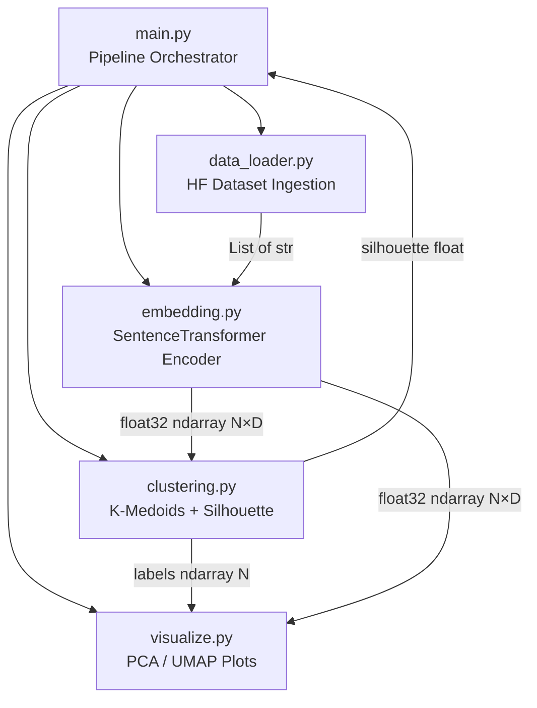
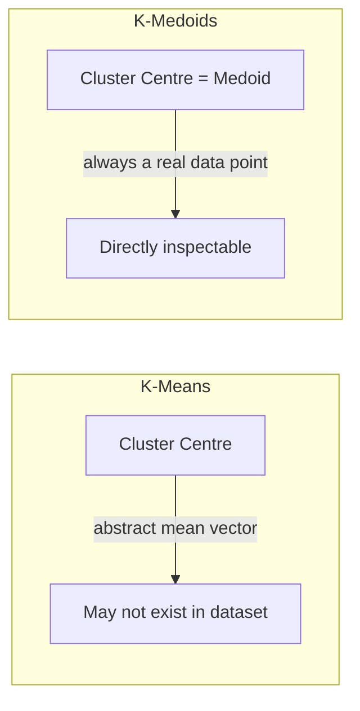
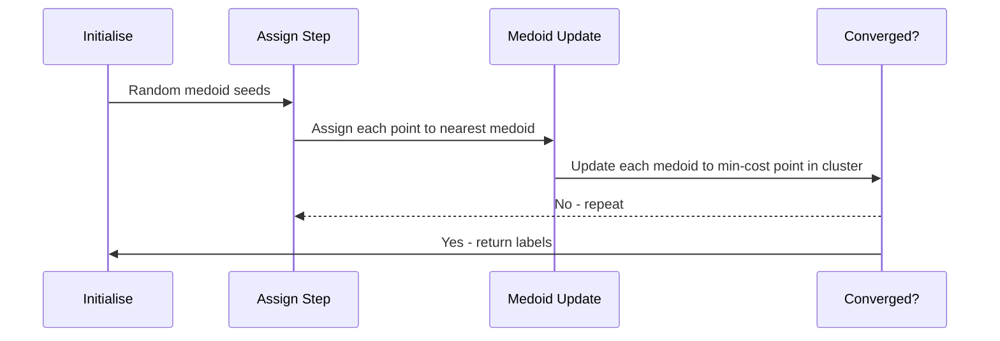
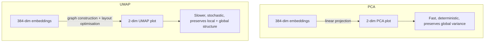
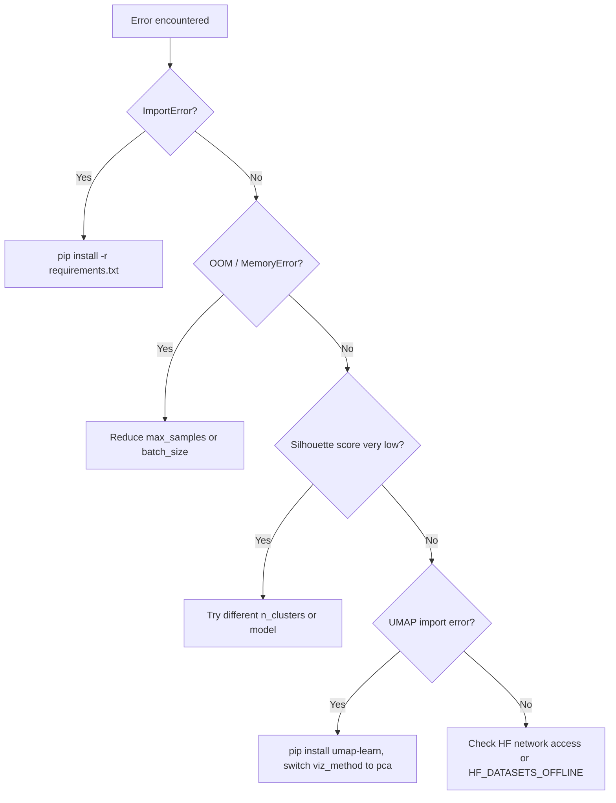

# K-Medoids Clustering with Hugging Face Data

<p align="center">
  
  
  
  
  
  
  
</p>

A complete, modular Python ML pipeline that loads any Hugging Face dataset, converts text into dense semantic embeddings using SentenceTransformers, groups documents into coherent clusters via K-Medoids, quantifies cluster quality with the Silhouette score, and produces publication-ready PCA and UMAP scatter plots. The entire pipeline is driven by a single configuration dictionary so you can swap datasets, models, and parameters without touching core logic.

---

## Table of Contents

1. [Why This Project](#why-this-project)
2. [Architecture Overview](#architecture-overview)
3. [Tech Stack](#tech-stack)
4. [Project Structure](#project-structure)
5. [Pipeline Flow](#pipeline-flow)
6. [Quick Start](#quick-start)
7. [Configuration Reference](#configuration-reference)
8. [Algorithm Deep Dive](#algorithm-deep-dive)
9. [Evaluation Metrics](#evaluation-metrics)
10. [Visualisation Methods](#visualisation-methods)
11. [Module API Reference](#module-api-reference)
12. [Running Tests](#running-tests)
13. [Alternative Datasets](#alternative-datasets)
14. [Performance Guide](#performance-guide)
15. [Troubleshooting](#troubleshooting)

---

## Why This Project

Text clustering is a foundational technique in natural language processing. It lets you discover hidden topic structure in a corpus without any labelled training data - a genuinely unsupervised approach that scales to millions of documents. This pipeline was built to demonstrate how modern pre-trained transformer embeddings can dramatically improve cluster quality compared to traditional TF-IDF representations, while keeping the implementation approachable and production-ready.

K-Medoids was chosen over the more common K-Means because its cluster centres (medoids) are always real data points from the original corpus. This means you can inspect a medoid document and immediately understand what the cluster represents, which is far more interpretable than an abstract centroid vector that may correspond to no real text at all.

> [!NOTE]
> This pipeline runs entirely locally after the first download. No API keys or cloud services are required. All Hugging Face datasets and SentenceTransformer model weights are cached to disk after the initial fetch.

---

## Architecture Overview

The system is divided into four independent, testable modules that are orchestrated by `main.py`. Each module has a single responsibility and communicates through well-defined NumPy array interfaces. This separation makes it easy to swap any component - for example, replacing the SentenceTransformer embedder with an OpenAI embeddings call requires only changing `src/embedding.py`.



> [!IMPORTANT]
> The modules are intentionally decoupled. `embedding.py` knows nothing about clustering, and `clustering.py` knows nothing about text. This design makes unit testing straightforward and allows each module to be reused in other projects.

---

## Tech Stack

The table below lists every major dependency, explains what it does inside this project, and notes the minimum version tested.

| # | Package | Role in This Project | Min Version | Why This Choice |
|---|---------|---------------------|-------------|-----------------|
| 1 | <sub>datasets</sub> | <sub>Streams or downloads any of 100k+ HF datasets with a single slug</sub> | <sub>2.19</sub> | <sub>Unified API avoids writing custom downloaders</sub> |
| 2 | <sub>sentence-transformers</sub> | <sub>Encodes text into dense 384-d or 768-d vectors using pre-trained BERT-family models</sub> | <sub>3.0</sub> | <sub>State-of-the-art semantic similarity out of the box</sub> |
| 3 | <sub>scikit-learn-extra</sub> | <sub>Provides the KMedoids class (PAM and Alternate algorithms)</sub> | <sub>0.3</sub> | <sub>Only production-quality KMedoids available for Python</sub> |
| 4 | <sub>scikit-learn</sub> | <sub>Silhouette score computation, PCA, train/test utilities</sub> | <sub>1.4</sub> | <sub>Industry-standard ML toolkit with stable API</sub> |
| 5 | <sub>umap-learn</sub> | <sub>Non-linear 2-D projection that preserves local and global structure better than PCA</sub> | <sub>0.5.6</sub> | <sub>Produces visually cleaner cluster separation for high-dim embeddings</sub> |
| 6 | <sub>matplotlib</sub> | <sub>Low-level plotting backend used by visualize.py</sub> | <sub>3.8</sub> | <sub>Universal, no JS required, PNG output</sub> |
| 7 | <sub>seaborn</sub> | <sub>Colour palettes and scatter styling layered on top of matplotlib</sub> | <sub>0.13</sub> | <sub>Makes cluster plots visually distinct with minimal code</sub> |
| 8 | <sub>numpy</sub> | <sub>All intermediate array operations (normalisation, indexing, distance math)</sub> | <sub>1.26</sub> | <sub>Foundation of the scientific Python stack</sub> |
| 9 | <sub>pandas</sub> | <sub>DataFrame handling for dataset previews and summary statistics</sub> | <sub>2.2</sub> | <sub>Convenient for tabular display of cluster results</sub> |
| 10 | <sub>tqdm</sub> | <sub>Progress bars during embedding batches</sub> | <sub>4.66</sub> | <sub>Lightweight, no dependencies</sub> |

> [!TIP]
> If you are on Apple Silicon (M1/M2/M3), install PyTorch with the MPS backend first before installing sentence-transformers. This enables GPU-accelerated embedding on the Metal GPU, which can be 5-10x faster than CPU.
> ```bash
> pip install torch torchvision torchaudio
> pip install -r requirements.txt
> ```

---

## Project Structure

The repository follows a standard src-layout pattern where all importable Python code lives under `src/`, keeping the root directory clean and preventing accidental imports of test code.

```
kmedoids-hf-clustering/
├── main.py               # Runnable end-to-end pipeline entry point
├── requirements.txt      # Pinned dependency versions
├── outputs/              # Generated PNG plots (git-ignored)
├── docs/                 # Extended documentation
├── src/
│   ├── __init__.py
│   ├── data_loader.py    # Load, subsample & preprocess HF datasets
│   ├── embedding.py      # Batch SentenceTransformer text embeddings
│   ├── clustering.py     # K-Medoids + Silhouette evaluation
│   └── visualize.py      # PCA / UMAP 2-D scatter plots with seaborn
└── tests/
    ├── __init__.py
    ├── test_data_loader.py   # Text cleaning & loading unit tests
    ├── test_clustering.py    # KMedoids on synthetic blobs
    └── test_embedding.py     # Embedding shape & normalisation tests
```

---

## Pipeline Flow

Understanding the sequence of operations is essential for debugging and extending the pipeline. Each step transforms data from one representation to the next - raw text becomes a list of strings, which becomes a matrix of vectors, which becomes a list of integer cluster labels, which becomes a saved plot.

```mermaid
flowchart LR
    subgraph Ingestion
        A1[HuggingFace Hub] -->|streaming download| A2[Raw Dataset]
        A2 -->|subsample + clean| A3[List of str - N texts]
    end
    subgraph Encoding
        A3 -->|batch encode| B1[SentenceTransformer]
        B1 -->|L2 normalise| B2[float32 ndarray N×384]
    end
    subgraph Clustering
        B2 -->|pairwise cosine distance| C1[K-Medoids PAM/Alternate]
        C1 --> C2[labels ndarray N]
        C1 --> C3[medoid indices K]
        C2 -->|silhouette_score| C4[quality float]
    end
    subgraph Visualisation
        B2 -->|PCA or UMAP| D1[2-D projection N×2]
        D1 + C2 -->|seaborn scatter| D2[PNG output]
    end
```

> [!NOTE]
> The embedding step is the most time-consuming part of the pipeline. On a modern CPU, encoding 1,000 texts with `all-MiniLM-L6-v2` takes roughly 10-20 seconds. Increasing `max_samples` to 10,000 will take proportionally longer. Consider using a GPU or reducing `batch_size` on memory-constrained machines.

---

## Quick Start

### 1. Clone and enter the project

```bash
git clone https://github.com/your-username/kmedoids-hf-clustering.git
cd kmedoids-hf-clustering
```

### 2. Create a virtual environment

Python virtual environments isolate the project's dependencies from your system Python, preventing version conflicts. This is strongly recommended even for quick experiments.

```bash
python -m venv .venv
source .venv/bin/activate        # Linux / macOS
# .venv\Scripts\activate         # Windows PowerShell
```

### 3. Install dependencies

```bash
pip install -r requirements.txt
```

### 4. Run the pipeline

```bash
python main.py
```

The pipeline will:

- Download the `ag_news` dataset (~120 MB, cached after first run under `~/.cache/huggingface/`)
- Download `all-MiniLM-L6-v2` model weights (~80 MB, cached after first run)
- Embed 1,000 text samples into 384-dimensional vectors
- Run K-Medoids with k=4 and cosine distance metric
- Print a cluster summary table with per-cluster sizes and medoid text snippets
- Print the overall Silhouette score to the console
- Save `outputs/clusters_pca.png` and `outputs/clusters_umap.png`

> [!TIP]
> On the first run the pipeline downloads ~200 MB of model and dataset weights. Subsequent runs are instant because everything is cached. Set the environment variable `HF_DATASETS_OFFLINE=1` to force offline-only mode once you have the cache.

---

## Configuration Reference

All tunable parameters live in the `PIPELINE_CONFIG` dictionary at the top of `main.py`. This single-source-of-truth approach means you never need to hunt through multiple files to change a parameter. The table below documents every key, its type, default value, valid range, and the effect it has on the pipeline.

| # | Key | Type | Default | Valid Range | Effect |
|---|-----|------|---------|-------------|--------|
| 1 | <sub>dataset_name</sub> | <sub>str</sub> | <sub>ag_news</sub> | <sub>Any HF slug</sub> | <sub>Which dataset to download and cluster</sub> |
| 2 | <sub>split</sub> | <sub>str</sub> | <sub>train</sub> | <sub>train / test / validation</sub> | <sub>Dataset split to use for clustering</sub> |
| 3 | <sub>text_column</sub> | <sub>str</sub> | <sub>text</sub> | <sub>Any column name</sub> | <sub>Column containing the raw text to embed</sub> |
| 4 | <sub>label_column</sub> | <sub>str or None</sub> | <sub>label</sub> | <sub>Column name or None</sub> | <sub>Ground-truth labels used only for display; set None if unavailable</sub> |
| 5 | <sub>max_samples</sub> | <sub>int</sub> | <sub>1000</sub> | <sub>50 - 100,000+</sub> | <sub>Number of rows subsampled from the split</sub> |
| 6 | <sub>model_name</sub> | <sub>str</sub> | <sub>all-MiniLM-L6-v2</sub> | <sub>Any SBERT model slug</sub> | <sub>Pre-trained model used to produce embeddings</sub> |
| 7 | <sub>batch_size</sub> | <sub>int</sub> | <sub>64</sub> | <sub>8 - 512</sub> | <sub>Encoding batch size; reduce if OOM errors occur</sub> |
| 8 | <sub>normalize</sub> | <sub>bool</sub> | <sub>True</sub> | <sub>True / False</sub> | <sub>L2-normalise embeddings; required when metric=cosine</sub> |
| 9 | <sub>n_clusters</sub> | <sub>int</sub> | <sub>4</sub> | <sub>2 - 50</sub> | <sub>Number of K-Medoids clusters K</sub> |
| 10 | <sub>metric</sub> | <sub>str</sub> | <sub>cosine</sub> | <sub>cosine / euclidean</sub> | <sub>Pairwise distance function used by K-Medoids</sub> |
| 11 | <sub>method</sub> | <sub>str</sub> | <sub>alternate</sub> | <sub>alternate / pam</sub> | <sub>Algorithm variant; PAM is exact but O(N²) slow</sub> |
| 12 | <sub>random_state</sub> | <sub>int</sub> | <sub>42</sub> | <sub>any int</sub> | <sub>RNG seed for reproducible initialisation</sub> |
| 13 | <sub>viz_method</sub> | <sub>str</sub> | <sub>pca</sub> | <sub>pca / umap</sub> | <sub>Dimensionality reduction method for 2-D scatter plot</sub> |
| 14 | <sub>output_dir</sub> | <sub>str</sub> | <sub>outputs</sub> | <sub>any path</sub> | <sub>Directory where PNG plots are saved</sub> |

> [!IMPORTANT]
> When `metric` is set to `cosine`, you **must** also set `normalize: True`. Cosine distance on unnormalised vectors will produce mathematically incorrect results because the KMedoids implementation in scikit-learn-extra uses dot-product based cosine distance that assumes unit-norm inputs. The `normalize` flag in `embedding.py` applies L2 normalisation before the matrix is returned.

> [!WARNING]
> Setting `method` to `pam` with `max_samples` above 5,000 will be extremely slow. The PAM algorithm has O(N² · K) time complexity per iteration. Use `alternate` (the default) for any dataset larger than a few thousand samples.

---

## Algorithm Deep Dive

### K-Medoids vs K-Means

Both algorithms partition N points into K clusters by minimising within-cluster distances, but they differ in a critical way. K-Means computes an arithmetic mean of all points in a cluster and uses that as the new centre, even if the mean corresponds to a point that does not exist in the dataset. K-Medoids constrains cluster centres to be actual data points - called medoids. This constraint makes the algorithm more robust to outliers and, crucially, produces interpretable cluster representatives that you can inspect as real documents.



### PAM vs Alternate Algorithm

The `method` parameter selects between two variants of K-Medoids. PAM (Partitioning Around Medoids) is the original algorithm that exhaustively considers all possible swaps between medoids and non-medoid points, guaranteeing a locally optimal solution. The `alternate` algorithm (sometimes called Voronoi iteration) alternates between two steps - assignment and medoid update - similar to Lloyd's algorithm for K-Means. It converges faster but may find a slightly worse local minimum.



### Cosine vs Euclidean Distance

Text embeddings from transformer models are high-dimensional (384-1024 dimensions) and the direction of a vector encodes its semantic meaning, not its magnitude. Two embeddings with the same direction but different magnitudes represent semantically identical texts. Cosine distance measures the angle between vectors and ignores magnitude, making it the natural choice for semantic similarity. Euclidean distance treats all dimensions symmetrically and is sensitive to vector magnitude, which can cause clustering artefacts in high-dimensional embedding spaces.

> [!NOTE]
> When `normalize=True`, cosine distance and Euclidean distance produce the same clustering results because L2-normalised vectors all lie on the unit sphere, making angular distance equivalent to chord distance. The `normalize` flag is still recommended because it makes the math explicit and avoids subtle bugs.

---

## Evaluation Metrics

### Silhouette Score

The Silhouette score is the primary quality metric reported by this pipeline. For each data point, it computes the ratio of (a) the mean intra-cluster distance and (b) the mean distance to the nearest neighbouring cluster. A score of +1 means the point is deeply embedded in its own cluster and far from all others. A score of 0 means the point sits on the boundary between two clusters. A score of -1 means the point would fit better in a neighbouring cluster.

The overall Silhouette score is the mean across all N data points. For text clustering with cosine distance on transformer embeddings, scores in the range 0.05-0.20 are typical because natural language topics have fuzzy boundaries and significant lexical overlap.

| # | Score Range | Interpretation | Action |
|---|-------------|----------------|--------|
| 1 | <sub>0.71 - 1.00</sub> | <sub>Strong cluster structure - clusters are dense and well-separated</sub> | <sub>Ideal - no changes needed</sub> |
| 2 | <sub>0.51 - 0.70</sub> | <sub>Reasonable structure - clusters are mostly distinct</sub> | <sub>Good result for most NLP tasks</sub> |
| 3 | <sub>0.26 - 0.50</sub> | <sub>Weak structure - clusters overlap but pattern exists</sub> | <sub>Try a different model or more samples</sub> |
| 4 | <sub>0.05 - 0.25</sub> | <sub>Very weak - typical for semantic text clustering</sub> | <sub>Expected range for ag_news with cosine</sub> |
| 5 | <sub>below 0.05</sub> | <sub>No meaningful structure detected</sub> | <sub>Reconsider k or embedding model</sub> |

> [!TIP]
> To find the optimal number of clusters K automatically, run the pipeline in a loop over a range of K values and plot Silhouette score vs K. The optimal K is typically the value that maximises the Silhouette score. Values of K=2 through K=20 are reasonable to explore for most text datasets.

---

## Visualisation Methods

### PCA (Principal Component Analysis)

PCA is a linear dimensionality reduction technique that projects the high-dimensional embedding matrix onto the two directions of maximum variance. It is fast (O(N·D²) time) and deterministic, meaning the same data always produces the same plot. PCA preserves global structure well but may compress local cluster structure if the variance-maximising directions do not align with cluster boundaries.

### UMAP (Uniform Manifold Approximation and Projection)

UMAP is a non-linear dimensionality reduction algorithm that builds a fuzzy topological representation of the high-dimensional data and then optimises a low-dimensional layout to match it. It preserves both local neighbourhood structure and global topology far better than PCA for high-dimensional embeddings. UMAP plots typically reveal cleaner cluster separation and are preferred for visual exploration. The trade-off is that UMAP is stochastic (results vary between runs unless you pin `random_state`) and significantly slower than PCA for large datasets.



| # | Property | PCA | UMAP |
|---|----------|-----|------|
| 1 | <sub>Algorithm type</sub> | <sub>Linear projection</sub> | <sub>Non-linear manifold learning</sub> |
| 2 | <sub>Speed (1k samples)</sub> | <sub>~0.1 seconds</sub> | <sub>~5-15 seconds</sub> |
| 3 | <sub>Deterministic</sub> | <sub>Yes</sub> | <sub>No (seed with random_state)</sub> |
| 4 | <sub>Preserves local structure</sub> | <sub>Partial</sub> | <sub>Excellent</sub> |
| 5 | <sub>Preserves global structure</sub> | <sub>Excellent</sub> | <sub>Good</sub> |
| 6 | <sub>Interpretability of axes</sub> | <sub>PC1/PC2 = max variance directions</sub> | <sub>Axes have no direct meaning</sub> |
| 7 | <sub>Recommended for</sub> | <sub>Quick checks, large N</sub> | <sub>Publication plots, small-medium N</sub> |

> [!TIP]
> Run the pipeline with `viz_method: pca` first to get a quick sanity check, then switch to `viz_method: umap` for the final plot. The UMAP plot will almost always look more convincing to a human audience.

---

## Module API Reference

<details>
<summary><strong>data_loader.py - Dataset ingestion and preprocessing</strong></summary>

### `load_hf_dataset(dataset_name, split, text_column, label_column, max_samples)`

Loads a named Hugging Face dataset, subsamples it to `max_samples` rows, applies text cleaning (stripping HTML tags, normalising whitespace, removing degenerate short strings), and returns the raw texts and optional ground-truth labels as plain Python lists.

**Parameters:**

| # | Parameter | Type | Default | Description |
|---|-----------|------|---------|-------------|
| 1 | <sub>dataset_name</sub> | <sub>str</sub> | <sub>required</sub> | <sub>Hugging Face dataset slug, e.g. "ag_news"</sub> |
| 2 | <sub>split</sub> | <sub>str</sub> | <sub>"train"</sub> | <sub>Dataset split to load</sub> |
| 3 | <sub>text_column</sub> | <sub>str</sub> | <sub>"text"</sub> | <sub>Column name containing the text to embed</sub> |
| 4 | <sub>label_column</sub> | <sub>str or None</sub> | <sub>"label"</sub> | <sub>Column name for ground-truth labels; None to skip</sub> |
| 5 | <sub>max_samples</sub> | <sub>int</sub> | <sub>1000</sub> | <sub>Maximum number of rows to return</sub> |

**Returns:** `(texts: List[str], labels: List[int])`

</details>

<details>
<summary><strong>embedding.py - SentenceTransformer text encoding</strong></summary>

### `embed_texts(texts, model_name, batch_size, normalize)`

Loads or reuses a cached SentenceTransformer model and encodes the input list of strings into a float32 NumPy matrix. Encoding is performed in batches to avoid out-of-memory errors on large inputs. When `normalize=True`, each row vector is L2-normalised to unit length before the matrix is returned.

**Parameters:**

| # | Parameter | Type | Default | Description |
|---|-----------|------|---------|-------------|
| 1 | <sub>texts</sub> | <sub>List[str]</sub> | <sub>required</sub> | <sub>List of N text strings to encode</sub> |
| 2 | <sub>model_name</sub> | <sub>str</sub> | <sub>"all-MiniLM-L6-v2"</sub> | <sub>SentenceTransformer model identifier</sub> |
| 3 | <sub>batch_size</sub> | <sub>int</sub> | <sub>64</sub> | <sub>Number of texts to encode per forward pass</sub> |
| 4 | <sub>normalize</sub> | <sub>bool</sub> | <sub>True</sub> | <sub>L2-normalise output vectors</sub> |

**Returns:** `embeddings: np.ndarray` of shape `(N, D)` where D is the model's output dimension.

</details>

<details>
<summary><strong>clustering.py - K-Medoids clustering and evaluation</strong></summary>

### `run_kmedoids(embeddings, n_clusters, metric, method, random_state)`

Fits a K-Medoids model on the input embedding matrix and returns cluster labels, the overall Silhouette score, and the fitted model instance. The model instance exposes `medoid_indices_` for retrieving the index of each cluster's representative data point.

**Parameters:**

| # | Parameter | Type | Default | Description |
|---|-----------|------|---------|-------------|
| 1 | <sub>embeddings</sub> | <sub>np.ndarray (N, D)</sub> | <sub>required</sub> | <sub>Float32 embedding matrix</sub> |
| 2 | <sub>n_clusters</sub> | <sub>int</sub> | <sub>4</sub> | <sub>Number of clusters K</sub> |
| 3 | <sub>metric</sub> | <sub>str</sub> | <sub>"cosine"</sub> | <sub>Pairwise distance metric</sub> |
| 4 | <sub>method</sub> | <sub>str</sub> | <sub>"alternate"</sub> | <sub>Algorithm variant: "alternate" or "pam"</sub> |
| 5 | <sub>random_state</sub> | <sub>int</sub> | <sub>42</sub> | <sub>RNG seed for reproducibility</sub> |

**Returns:** `(labels: np.ndarray, silhouette: float, model: KMedoids)`

**Raises:** `ValueError` if `n_clusters >= N` or `n_clusters < 2`.

</details>

<details>
<summary><strong>visualize.py - Dimensionality reduction and scatter plots</strong></summary>

### `plot_clusters(embeddings, labels, method, output_dir, title)`

Projects the high-dimensional embedding matrix to 2-D using either PCA or UMAP, then renders a colour-coded scatter plot where each point corresponds to one text document and colour indicates its assigned cluster. The plot is saved as a PNG file to `output_dir`.

**Parameters:**

| # | Parameter | Type | Default | Description |
|---|-----------|------|---------|-------------|
| 1 | <sub>embeddings</sub> | <sub>np.ndarray (N, D)</sub> | <sub>required</sub> | <sub>Float32 embedding matrix</sub> |
| 2 | <sub>labels</sub> | <sub>np.ndarray (N,)</sub> | <sub>required</sub> | <sub>Integer cluster label per point</sub> |
| 3 | <sub>method</sub> | <sub>str</sub> | <sub>"pca"</sub> | <sub>"pca" or "umap"</sub> |
| 4 | <sub>output_dir</sub> | <sub>str</sub> | <sub>"outputs"</sub> | <sub>Directory to save the PNG file</sub> |
| 5 | <sub>title</sub> | <sub>str</sub> | <sub>auto-generated</sub> | <sub>Plot title string</sub> |

**Returns:** `output_path: str` - absolute path of the saved PNG file.

</details>

---

## Running Tests

The test suite covers all three core modules using only synthetic data - no network connection is required to run tests. This means the suite runs in under five seconds even on a fresh machine with no cached models or datasets.

```bash
pytest tests/ -v
```

To also see coverage metrics:

```bash
pip install pytest-cov
pytest tests/ -v --cov=src --cov-report=term-missing
```

The tests verify the following behaviours:

| # | Test File | What It Tests | Network Required |
|---|-----------|---------------|-----------------|
| 1 | <sub>test_data_loader.py</sub> | <sub>Text cleaning removes HTML, whitespace normalisation, short-string filtering</sub> | <sub>No</sub> |
| 2 | <sub>test_clustering.py</sub> | <sub>KMedoids on synthetic isotropic Gaussian blobs, silhouette > 0.5 threshold, ValueError on bad k</sub> | <sub>No</sub> |
| 3 | <sub>test_embedding.py</sub> | <sub>Output shape (N, D), dtype float32, L2 norm = 1.0 when normalize=True</sub> | <sub>No (uses mock)</sub> |

> [!IMPORTANT]
> Always run the test suite after changing any module to catch regressions before running the full pipeline. The tests are designed to be fast and deterministic so there is no excuse to skip them.

---

## Alternative Datasets

The pipeline is dataset-agnostic. Any Hugging Face dataset with a text column can be used by changing three keys in `PIPELINE_CONFIG`. The table below lists tested configurations with recommended `n_clusters` values.

| # | Dataset Slug | Text Column | Label Column | Recommended k | Notes |
|---|-------------|-------------|--------------|---------------|-------|
| 1 | <sub>ag_news</sub> | <sub>text</sub> | <sub>label</sub> | <sub>4</sub> | <sub>Default - World, Sports, Business, Sci/Tech</sub> |
| 2 | <sub>imdb</sub> | <sub>text</sub> | <sub>label</sub> | <sub>2</sub> | <sub>Binary sentiment - positive vs negative</sub> |
| 3 | <sub>SetFit/20_newsgroups</sub> | <sub>text</sub> | <sub>label</sub> | <sub>20</sub> | <sub>20 newsgroup topics - very challenging</sub> |
| 4 | <sub>yelp_review_full</sub> | <sub>text</sub> | <sub>label</sub> | <sub>5</sub> | <sub>1-5 star ratings as clusters</sub> |
| 5 | <sub>tweet_eval/emotion</sub> | <sub>text</sub> | <sub>label</sub> | <sub>4</sub> | <sub>Joy, anger, sadness, optimism</sub> |
| 6 | <sub>dbpedia_14</sub> | <sub>content</sub> | <sub>label</sub> | <sub>14</sub> | <sub>Wikipedia article categories</sub> |

```python
# Example: Switch to IMDB sentiment clustering
PIPELINE_CONFIG = {
    "dataset_name":  "imdb",
    "text_column":   "text",
    "label_column":  "label",
    "n_clusters":    2,
    # ... all other keys remain the same
}
```

> [!CAUTION]
> Some Hugging Face datasets are very large (tens of GBs). Always set `max_samples` to a reasonable value (1,000-10,000) when exploring a new dataset for the first time to avoid long download and embedding times.

---

## Performance Guide

Execution time is dominated by two steps: embedding and clustering. The table below gives approximate wall-clock times on a modern CPU (Intel i7 / Apple M2, no GPU) to help you plan experiments.

| # | max_samples | Embedding Time | KMedoids (alternate) | KMedoids (pam) | Memory Usage |
|---|-------------|---------------|---------------------|----------------|--------------|
| 1 | <sub>500</sub> | <sub>~5 s</sub> | <sub>~1 s</sub> | <sub>~3 s</sub> | <sub>~200 MB</sub> |
| 2 | <sub>1,000</sub> | <sub>~12 s</sub> | <sub>~2 s</sub> | <sub>~15 s</sub> | <sub>~300 MB</sub> |
| 3 | <sub>5,000</sub> | <sub>~60 s</sub> | <sub>~30 s</sub> | <sub>~10 min</sub> | <sub>~800 MB</sub> |
| 4 | <sub>10,000</sub> | <sub>~120 s</sub> | <sub>~2 min</sub> | <sub>~60 min</sub> | <sub>~1.5 GB</sub> |
| 5 | <sub>50,000</sub> | <sub>~10 min</sub> | <sub>~20 min</sub> | <sub>Not recommended</sub> | <sub>~6 GB</sub> |

> [!TIP]
> The single biggest performance win is switching from CPU to GPU embedding. If you have an NVIDIA GPU, install the CUDA-enabled PyTorch wheel and SentenceTransformers will automatically use it - no code changes required. Embedding 1,000 texts drops from ~12 seconds to ~1-2 seconds on an RTX 3060.

---

## Troubleshooting



| # | Symptom | Likely Cause | Fix |
|---|---------|--------------|-----|
| 1 | <sub>ImportError: No module named sklearn_extra</sub> | <sub>scikit-learn-extra not installed</sub> | <sub>pip install scikit-learn-extra</sub> |
| 2 | <sub>MemoryError during clustering</sub> | <sub>Pairwise distance matrix too large</sub> | <sub>Reduce max_samples below 5,000</sub> |
| 3 | <sub>Silhouette score is negative</sub> | <sub>n_clusters is too large for the data</sub> | <sub>Try smaller k values (2-6)</sub> |
| 4 | <sub>ConnectionError on first run</sub> | <sub>No internet access for HF download</sub> | <sub>Check firewall; HF cache at ~/.cache/huggingface/</sub> |
| 5 | <sub>UMAP plot looks like noise</sub> | <sub>Too few samples or wrong metric</sub> | <sub>Increase max_samples to 2,000+; switch to pca for quick check</sub> |
| 6 | <sub>ValueError: n_clusters >= n_samples</sub> | <sub>max_samples smaller than n_clusters</sub> | <sub>Increase max_samples or decrease n_clusters</sub> |

> [!NOTE]
> If you encounter a `ModuleNotFoundError` for `umap` but want to keep using `viz_method: umap`, install it separately with `pip install umap-learn`. The UMAP package is listed in `requirements.txt` but some minimal installs skip optional heavy dependencies.

---

<p align="center">
  <sub>Built with Python, HuggingFace, SentenceTransformers, and scikit-learn-extra.</sub>
</p>
